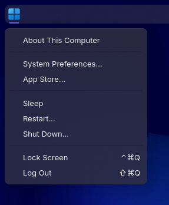
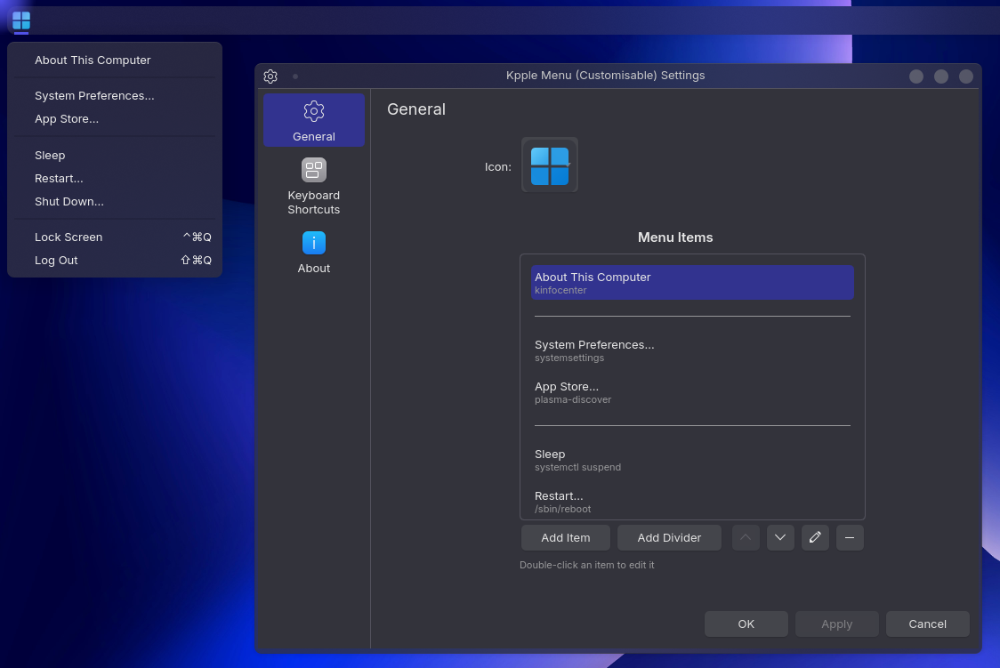

# Kpple Menu (Customizable)

A macOS-style Apple menu for KDE Plasma 6, now fully customizable.

Forked from [ChrTall's Kpple Menu](https://github.com/ChrTall/kppleMenu).

## Features

- Add, remove, and reorder menu items
- Create custom menu items with any command
- Add dividers anywhere in the menu
- Edit item names and commands
- Optional keyboard shortcut labels
- Custom panel icon support

## Previews

<p align="center">
     
</p>

## Default Menu Items

- About This Computer (System Info)
- System Preferences
- App Store (Discover)
- Sleep, Restart, Shut Down
- Lock Screen & Log Out

All items can be customised, removed, or reordered in settings.

## Installation

### From KDE Store (Recommended)

Install via the [KDE Store](https://store.kde.org) (link coming soon).

### Manual Installation

```bash
git clone https://github.com/edmogeor/kppleMenu.git
kpackagetool6 --type "Plasma/Applet" -i kppleMenu/package
```

To uninstall:
```bash
kpackagetool6 --type "Plasma/Applet" -r com.github.edmogeor.kppleMenu
```

## Usage

1. Add the widget to your panel
2. Right-click and select "Configure..."
3. Use the menu editor to add, remove, edit, or reorder items
4. Click "Add Item" for custom commands or "Add Divider" for separators

### Keyboard Navigation

- Configure a global shortcut under Settings → Keyboard Shortcuts
- Navigate with Tab/Shift+Tab or Arrow keys
- Press Enter or Space to execute selected item
- Lock Screen: Ctrl + Alt + Q
- Log Out: Shift + Alt + Q

## Credits

- Original Kpple Menu by [Kpple](mailto:info.kpple@gmail.com) (2020)
- KDE Plasma 6 port by [ChrTall](https://github.com/ChrTall) (2024)

## License

GNU GPL v2.0
